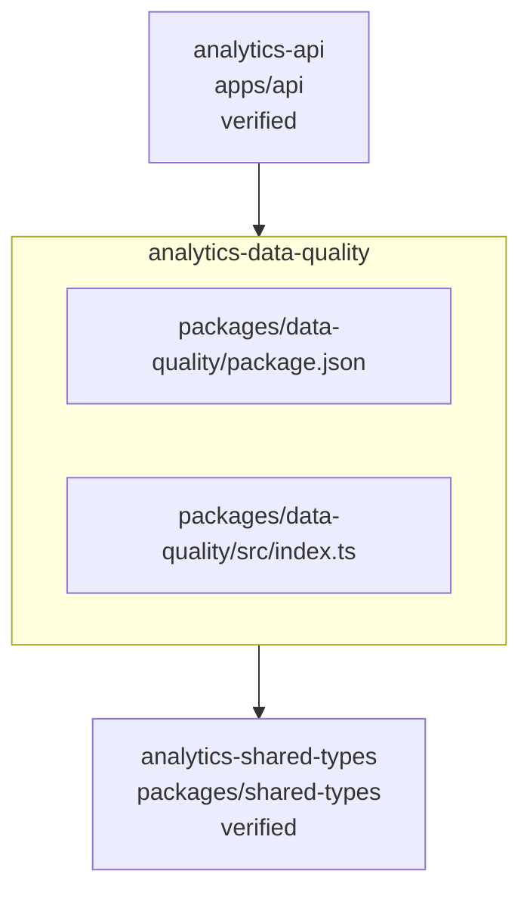

<!-- KAAF-GENERATED — do not edit by hand. Regenerate with scripts/architecture/generate.sh. -->

# Component — analytics-data-quality (C4 L3)

`analytics-data-quality` at `packages/data-quality` — confidence `verified`. 2 declared public entry point(s), 1 dependency(ies), 1 dependent(s).

**Reading this diagram**

- Solid arrow: a dependency declared in a `kaaf.module.json` manifest.
- Dotted arrow: a real import discovered in the source that no manifest declares — see `.ai/drift.json`.
- Node outline reflects confidence: solid = `verified`, dashed = `documented` or `derived`.
<!-- kaaf:bodyDigest=4c6aa18b51cc3e42f8883004f32e8920d5ceb29d8676915862d5dc08de26fc4d -->
