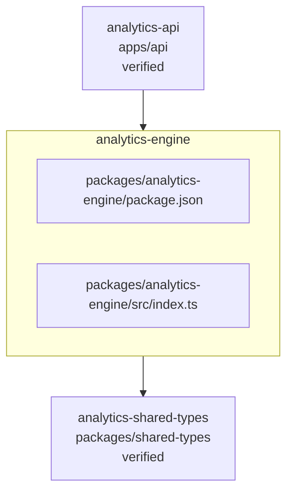

<!-- KAAF-GENERATED — do not edit by hand. Regenerate with scripts/architecture/generate.sh. -->

# Component — analytics-engine (C4 L3)

`analytics-engine` at `packages/analytics-engine` — confidence `verified`. 2 declared public entry point(s), 1 dependency(ies), 1 dependent(s).

**Reading this diagram**

- Solid arrow: a dependency declared in a `kaaf.module.json` manifest.
- Dotted arrow: a real import discovered in the source that no manifest declares — see `.ai/drift.json`.
- Node outline reflects confidence: solid = `verified`, dashed = `documented` or `derived`.
<!-- kaaf:bodyDigest=b972a9be075a67d0750aeaad6950ab21d04af59dae33fb31503eff3d7d00aa4b -->
