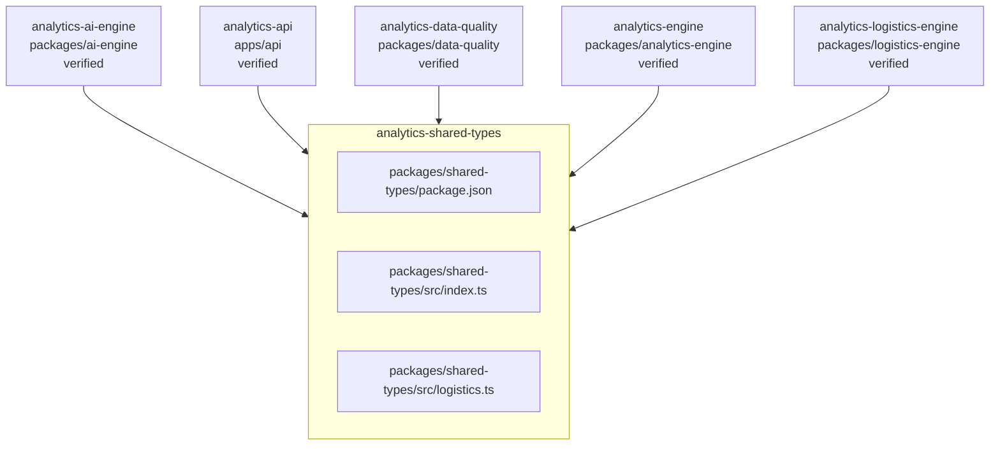

<!-- KAAF-GENERATED — do not edit by hand. Regenerate with scripts/architecture/generate.sh. -->

# Component — analytics-shared-types (C4 L3)

`analytics-shared-types` at `packages/shared-types` — confidence `verified`. 3 declared public entry point(s), 0 dependency(ies), 5 dependent(s).

**Reading this diagram**

- Solid arrow: a dependency declared in a `kaaf.module.json` manifest.
- Dotted arrow: a real import discovered in the source that no manifest declares — see `.ai/drift.json`.
- Node outline reflects confidence: solid = `verified`, dashed = `documented` or `derived`.
<!-- kaaf:bodyDigest=ec2abfa9e987413061ea3ef33b0c97426c640a15712e7b99dd0ddb0826805f4b -->
