<!-- KAAF-GENERATED — do not edit by hand. Regenerate with scripts/architecture/generate.sh. -->

# Context (C4 L1)

What KYNOX Logix is and what it depends on. 4 external integration(s).

```mermaid
graph TB
  KYNOX_Logix["KYNOX Logix<br/>Islamce/kynox-logix"]
  subgraph external[External systems]
    ext_Anthropic_API["Anthropic API<br/>ai-provider<br/>optional"]
    ext_Knex_relational_database_SQLite_in_development_PostgreSQL_and_MySQL_adapters_for_hosted_environments["Knex relational database &#40;SQLite in development; PostgreSQL and MySQL adapters for hosted environments&#41;<br/>database<br/>required"]
    ext_OpenAI_API["OpenAI API<br/>ai-provider<br/>optional"]
    ext_PM2["PM2<br/>process-manager<br/>required"]
  end
  KYNOX_Logix -->|via analytics-ai-engine| ext_Anthropic_API
  KYNOX_Logix -->|via analytics-api| ext_Knex_relational_database_SQLite_in_development_PostgreSQL_and_MySQL_adapters_for_hosted_environments
  KYNOX_Logix -->|via analytics-ai-engine| ext_OpenAI_API
  KYNOX_Logix -->|via analytics-runtime-entry| ext_PM2
```

<!-- kaaf:bodyDigest=48e15c6e05682a4ab21a588dceb6610ab1323c26c90e061d2321dca61bee42fc -->
