<!-- KAAF-GENERATED — do not edit by hand. Regenerate with scripts/architecture/generate.sh. -->

# Context (C4 L1)

What Kynox Inventory Intelligence is and what it depends on. 4 external integration(s).

```mermaid
graph TB
  Kynox_Inventory_Intelligence["Kynox Inventory Intelligence<br/>Islamce/kynox-inventory-analytics"]
  subgraph external[External systems]
    ext_Anthropic_API["Anthropic API<br/>ai-provider<br/>optional"]
    ext_Knex_relational_database_SQLite_in_development_PostgreSQL_and_MySQL_adapters_for_hosted_environments["Knex relational database &#40;SQLite in development; PostgreSQL and MySQL adapters for hosted environments&#41;<br/>database<br/>required"]
    ext_OpenAI_API["OpenAI API<br/>ai-provider<br/>optional"]
    ext_PM2["PM2<br/>process-manager<br/>required"]
  end
  Kynox_Inventory_Intelligence -->|via analytics-ai-engine| ext_Anthropic_API
  Kynox_Inventory_Intelligence -->|via analytics-api| ext_Knex_relational_database_SQLite_in_development_PostgreSQL_and_MySQL_adapters_for_hosted_environments
  Kynox_Inventory_Intelligence -->|via analytics-ai-engine| ext_OpenAI_API
  Kynox_Inventory_Intelligence -->|via analytics-runtime-entry| ext_PM2
```

<!-- kaaf:bodyDigest=cc8bba3e7b479db39c188bab68569444e4c1bfbd26d3b5fb17ce7c9cccd1cdb2 -->
