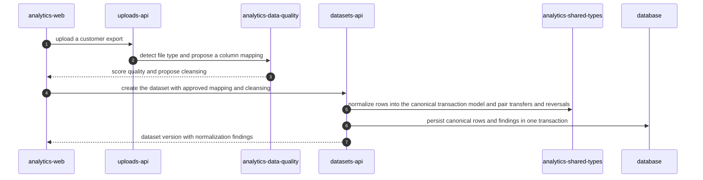

<!-- KAAF-GENERATED — do not edit by hand. Regenerate with scripts/architecture/generate.sh. -->

# Flow — Ingest a customer export into the canonical model

Ingest a customer export into the canonical model — declared by `analytics-api` in `apps/api/kaaf.module.json`.

<!-- kaaf:bodyDigest=bda66cb172561be334568d63e6a29c4b4a3a3df657bae7ba9824ec8a2eca9cc2 -->
