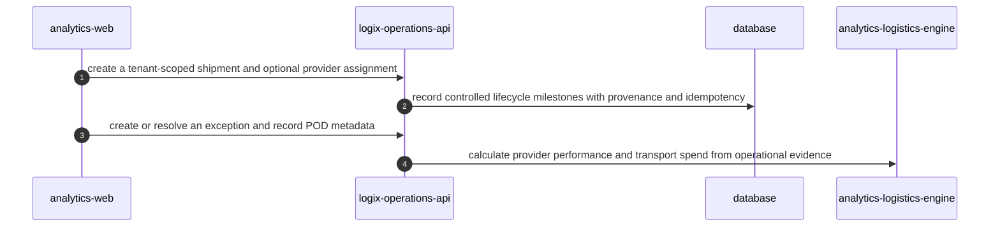

<!-- KAAF-GENERATED — do not edit by hand. Regenerate with scripts/architecture/generate.sh. -->

# Flow — Operate a shipment from planning through POD evidence

Operate a shipment from planning through POD evidence — declared by `analytics-api` in `apps/api/kaaf.module.json`.

<!-- kaaf:bodyDigest=862f210d56fc2c9b4b266a3e558bafc750bd54beb017a8d4aa94d17666a1f2ff -->
