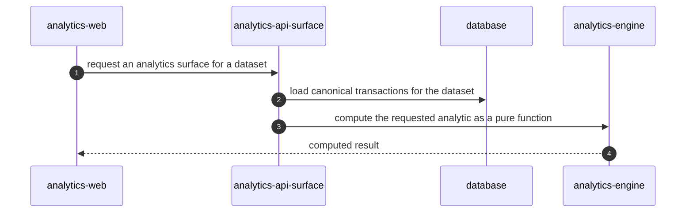

<!-- KAAF-GENERATED — do not edit by hand. Regenerate with scripts/architecture/generate.sh. -->

# Flow — Serve an analytics surface from canonical transactions

Serve an analytics surface from canonical transactions — declared by `analytics-api` in `apps/api/kaaf.module.json`.

<!-- kaaf:bodyDigest=0eb1e9233519326ab9b3d335c02543d4c38eab9b14b1a69a9f49e2a2c19cac04 -->
