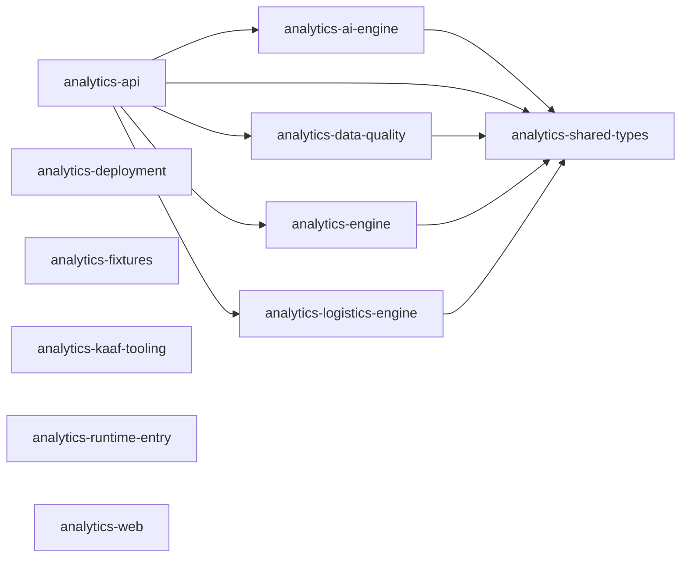

<!-- KAAF-GENERATED — do not edit by hand. Regenerate with scripts/architecture/generate.sh. -->

# KYNOX Logix — Architecture Summary

KYNOX Logix — a tenant-scoped logistics operations, 3PL management and future 4PL orchestration platform with embedded KYNOX intelligence. It retains governed inventory analytics while owning transport requirements, shipments, provider coordination, operational events, exceptions, POD metadata and freight operational context.

- Repository: `Islamce/kynox-logix`
- Default branch: `main`
- KAAF phase: 7
- Modules: 11 declared, 0 discovered only
- Drift: 0 error, 0 warning, 2 info
- Generator: `kaaf` v0.7.0
- Input digest: `e9f05acc14e56406…`

## Modules

Confidence is computed from evidence, not copied from the manifest: `verified` =
declared and corroborated by discovered code, `documented` = declared with no code to
check against, `derived` = discovered with no declaration.

| Module | Path | Owner | Purpose | Confidence |
|---|---|---|---|---|
| `analytics-ai-engine` | `packages/ai-engine` | AI Engineering | Run the documented analytics agents over evidence packages built from verified data, behind a provider abstraction so no single vendor is load-bearing. | `verified` |
| `analytics-api` | `apps/api` | Backend | Serve KYNOX Logix over HTTP: resolve fail-closed tenant and membership context, preserve governed inventory diagnostics and analytics, and operate tenant-scoped transport requirements, shipments, providers, lifecycle events, exceptions, POD metadata, freight operational context and deterministic logistics intelligence. | `verified` |
| `analytics-data-quality` | `packages/data-quality` | Data | Score incoming customer data, propose and apply cleansing, and normalize ambiguous values such as dates so downstream analytics receive evidence-tagged input. | `verified` |
| `analytics-deployment` | `scripts/deployment` | DevOps | Carry out staged deployment and its safety operations — preflight checks, database backup and restore, rollback, and post-deploy smoke tests. Executing any of these against a real environment is a protected action requiring approval. | `verified` |
| `analytics-engine` | `packages/analytics-engine` | Data | Compute the inventory analytics the product sells — ABC, XYZ, aging, consumption, excess, shortage, health, forecasting and planning — as pure functions over canonical transactions. | `verified` |
| `analytics-fixtures` | `scripts` | Data | Generate synthetic UAT and demonstration datasets so the platform can be exercised without customer data. | `verified` |
| `analytics-kaaf-tooling` | `scripts/architecture` | DevOps | Generate and validate this repository's KAAF architecture context. Vendored from Islamce/KAAF; see VENDORED.md before changing anything here. | `verified` |
| `analytics-logistics-engine` | `packages/logistics-engine` | Data | Compute bounded Logistics Intelligence metrics as pure, evidence-oriented functions without owning warehouse execution, project/WBS truth, or transport execution. | `verified` |
| `analytics-runtime-entry` | `.` | DevOps | Start the production process: boot the API, which also serves the built web SPA, under the PM2 configuration used on the managed host. | `verified` |
| `analytics-shared-types` | `packages/shared-types` | Backend | Define shared canonical transaction and logistics-operation vocabulary, read-only WMS/R4C references, and the single role-to-permission matrix used by all Logix modules. | `verified` |
| `analytics-web` | `apps/web` | Frontend | Present KYNOX Logix inventory intelligence and operator workspaces, including tenant-scoped shipment, provider, milestone, exception, POD-evidence and logistics-intelligence journeys, as a React SPA served by the API in production. | `verified` |

## Dependencies

Solid edges are declared in the manifests. Dotted edges were discovered from real
imports but are not declared — see the drift section below.

## Public contracts

| Contract | Kind | Module | Path | Stability |
|---|---|---|---|---|
| `admin-api` | rest | `analytics-api` | `apps/api/src/routes/admin.ts` | evolving |
| `ai-api` | rest | `analytics-api` | `apps/api/src/routes/ai.ts` | experimental |
| `analytics-api-surface` | rest | `analytics-api` | `apps/api/src/routes/analytics.ts` | evolving |
| `auth-api` | rest | `analytics-api` | `apps/api/src/routes/auth.ts` | stable |
| `datasets-api` | rest | `analytics-api` | `apps/api/src/routes/datasets.ts` | evolving |
| `exports-api` | rest | `analytics-api` | `apps/api/src/routes/exports.ts` | evolving |
| `logix-operations-api` | rest | `analytics-api` | `apps/api/src/routes/operations.ts` | evolving |
| `maintenance-api` | rest | `analytics-api` | `apps/api/src/routes/maintenance.ts` | experimental |
| `uploads-api` | rest | `analytics-api` | `apps/api/src/routes/uploads.ts` | evolving |

## Permissions

| Key | Module | Roles | Enforced at |
|---|---|---|---|
| `analytics.ai.use` | `analytics-api` | system_admin, data_admin, supply_chain_director, supply_chain_manager, inventory_manager, warehouse_manager, material_planner, inventory_controller, data_analyst, executive_viewer | `apps/api/src/middleware/auth.ts`, `apps/api/src/routes/ai.ts` |
| `analytics.analysis.run` | `analytics-api` | system_admin, data_admin, supply_chain_director, supply_chain_manager, inventory_manager, warehouse_manager, material_planner, inventory_controller, data_analyst, executive_viewer | `apps/api/src/middleware/auth.ts`, `apps/api/src/routes/analytics.ts` |
| `analytics.audit.read` | `analytics-api` | system_admin, data_admin, supply_chain_director, auditor | `apps/api/src/middleware/auth.ts`, `apps/api/src/routes/admin.ts` |
| `analytics.cleansing.approve` | `analytics-api` | system_admin, data_admin, supply_chain_manager, inventory_manager, material_planner | `apps/api/src/middleware/auth.ts`, `apps/api/src/routes/datasets.ts` |
| `analytics.config.update` | `analytics-api` | system_admin | `apps/api/src/middleware/auth.ts`, `apps/api/src/routes/admin.ts` |
| `analytics.dataset.delete` | `analytics-api` | system_admin, data_admin | `apps/api/src/middleware/auth.ts`, `apps/api/src/routes/datasets.ts` |
| `analytics.dataset.read` | `analytics-api` | system_admin, data_admin, supply_chain_director, supply_chain_manager, inventory_manager, warehouse_manager, material_planner, inventory_controller, data_analyst, auditor, executive_viewer, read_only | `apps/api/src/middleware/auth.ts`, `apps/api/src/routes/datasets.ts` |
| `analytics.export.execute` | `analytics-api` | system_admin, data_admin, supply_chain_director, supply_chain_manager, inventory_manager, warehouse_manager, material_planner, inventory_controller, data_analyst, auditor | `apps/api/src/middleware/auth.ts`, `apps/api/src/routes/exports.ts` |
| `analytics.mapping.update` | `analytics-api` | system_admin, data_admin, supply_chain_manager, inventory_manager, material_planner, data_analyst | `apps/api/src/middleware/auth.ts`, `apps/api/src/routes/datasets.ts` |
| `analytics.upload.create` | `analytics-api` | system_admin, data_admin, supply_chain_manager, inventory_manager, warehouse_manager, material_planner, data_analyst | `apps/api/src/middleware/auth.ts`, `apps/api/src/routes/uploads.ts` |
| `analytics.user.manage` | `analytics-api` | system_admin | `apps/api/src/middleware/auth.ts`, `apps/api/src/routes/admin.ts` |
| `manage_operations` | `analytics-api` | system_admin, data_admin, supply_chain_manager | `apps/api/src/middleware/auth.ts`, `apps/api/src/routes/operations.ts` |
| `manage_providers` | `analytics-api` | system_admin, data_admin, supply_chain_manager | `apps/api/src/middleware/auth.ts`, `apps/api/src/routes/operations.ts` |
| `record_pod` | `analytics-api` | system_admin, data_admin, supply_chain_manager, warehouse_manager | `apps/api/src/middleware/auth.ts`, `apps/api/src/routes/operations.ts` |
| `view_operations` | `analytics-api` | system_admin, data_admin, supply_chain_director, supply_chain_manager, inventory_manager, warehouse_manager, material_planner, inventory_controller, data_analyst, auditor, executive_viewer, read_only | `apps/api/src/middleware/auth.ts`, `apps/api/src/routes/operations.ts` |

## External integrations

| Integration | Module | Criticality | On unavailability |
|---|---|---|---|
| Anthropic API | `analytics-ai-engine` | optional | AI agents return a controlled error; every non-AI analytics surface is unaffected. |
| OpenAI API | `analytics-ai-engine` | optional | AI agents return a controlled error; every non-AI analytics surface is unaffected. |
| Knex relational database (SQLite in development; PostgreSQL and MySQL adapters for hosted environments) | `analytics-api` | required | The API cannot serve or ingest any dataset. Production startup refuses SQLite. |
| PM2 | `analytics-runtime-entry` | required | The production process is not supervised; a crash is not restarted automatically. |

## Drift — declared versus discovered

0 error, 0 warning, 2 info. Errors block CI; warnings and information do not.

| Severity | Type | Module | Finding |
|---|---|---|---|
| `info` | `large-public-surface` | `analytics-logistics-engine` | 13 public symbols at the entry points (guideline is 10). |
| `info` | `large-public-surface` | `analytics-shared-types` | 52 public symbols at the entry points (guideline is 10). |

Full detail, with evidence and recommendations, in `.ai/drift.json`.

## How to use this

1. Read `.ai/ai-context.json` for the module index and conventions.
2. Read this summary for orientation.
3. Read `.ai/modules/<id>.json` for the module your task touches.
4. Check `.ai/drift.json` before trusting a declaration.
5. Open only the source files those steps referenced.

Declarations come from `kaaf.repo.json` and `kaaf.module.json`. Discovery is a static
read of the source: dynamic imports and runtime wiring are invisible to it, so the
absence of a drift finding is not proof that none exists.
<!-- kaaf:bodyDigest=afbb614d7dc51ece54254949aaf9f530e6d2c0e69d1dbadd473fe1b2ae41cfd8 -->
