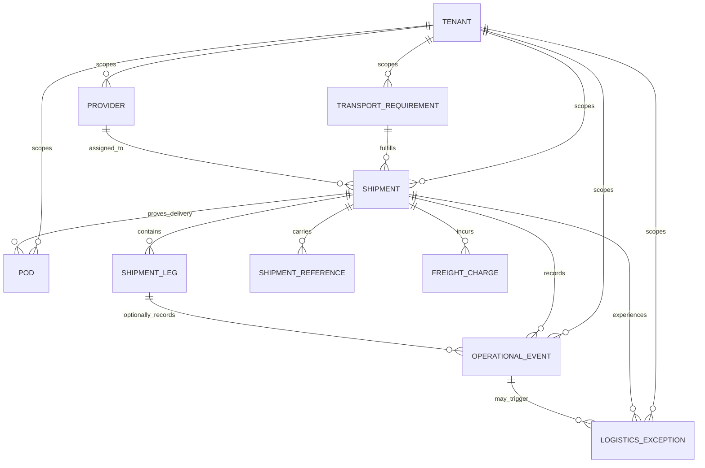

# Canonical Operations Model

**Status:** MVP 1 canonical model and evolution contract.  
**Design rule:** The model establishes stable operational identities and audited relationships without claiming ownership of every enterprise master-data attribute.

> Canonical IDs are KYNOX-controlled identifiers. External ERP, WMS, carrier and R4C identifiers are stored as **source references** rather than substituted for canonical IDs.

## Identity and tenancy

Every persisted operational entity is scoped by `tenant_id`. All user-facing and integration-facing identifiers are opaque canonical IDs generated by Logix. Natural business identifiers, source-system identifiers and external tracking numbers are indexed references, not authorization keys.

| Identifier | Meaning | Authority | Constraint |
|---|---|---|---|
| `tenant_id` | Isolates customer/account data. | Existing Logix tenant model. | Required on every operational row and object-level query. |
| `organization_id` | Business organization context within a tenant. | Tenant-configured / external master source. | Optional until organization master governance is implemented; never substitutes `tenant_id`. |
| `shipment_id` | Canonical shipment identity. | Logix. | Opaque, tenant-scoped and stable through lifecycle. |
| `transport_requirement_id` | Canonical logistics demand identity. | Logix. | Links source order/project/delivery references to planned transport work. |
| `provider_id` | Canonical logistics-provider identity. | Logix. | Represents carrier, 3PL or forwarder operational profile. |
| `location_id` | Canonical named location reference. | Logix adapter/master policy. | May map to WMS warehouse/site/port/hub source IDs. |
| `material_id` | Canonical material reference. | Shared master-data policy. | In MVP 1 it can be a reference from governed source data; Logix does not become material-master authority. |
| `order_id` / `project_id` | Canonical external-context reference. | ERP/R4C source system. | Logix records external/source identifiers separately and never takes ownership. |
| `correlation_id` | Cross-event operation trace. | Logix / integration caller. | Required for event envelope; follows a workflow or import chain. |
| `idempotency_key` | Replay protection key. | Integration caller or Logix API. | Unique within tenant, operation type and source scope. |

## MVP 1 entities

| Entity | Business owner / system of record | Required relationships | Lifecycle | Audit behavior |
|---|---|---|---|---|
| Provider | Logistics operations / Logix | Tenant; optional parent provider; service capabilities. | Active, inactive, suspended. | Profile and status changes are audited. |
| Transport Requirement | Logistics operations / Logix | Tenant; external demand reference; origin/destination; required-by date; optional project/order/material links. | Draft, requested, planned, converted, cancelled. | Creation, source changes and conversion are audited. |
| Shipment | Logistics operations / Logix | Tenant; optional requirement; provider assignment; locations; material/demand context. | Planned through Closed; cancellation exceptional. | State transition and assignment audit required. |
| Shipment Leg | Logistics operations / Logix | Tenant; shipment; sequence; mode; origin/destination; provider if leg-specific. | Inherits shipment plan/execution context. | Creation and chronology changes are audited. |
| Shipment Reference | Logistics operations / Logix | Shipment; type; value; source reference. | Immutable unless corrected under audit. | External tracking, PO/order/project links remain traceable. |
| Milestone / Operational Event | Logistics operations / Logix normalized evidence | Tenant; shipment; optional leg; event type; occurred/planned time; source. | Append-only facts; supersession rather than mutation. | Idempotency, payload digest, source, chronology and actor captured. |
| Logistics Exception | Logistics operations / Logix | Tenant; shipment; optional event/leg; severity; owner; impact references. | Open, acknowledged, in progress, resolved, dismissed. | Ownership, SLA, escalation and resolution append audit history. |
| POD | Logistics operations / Logix metadata | Tenant; shipment; delivery event; attachment metadata/ref. | Pending, received, rejected, verified. | Uploader, checksum, content type, authorization and association are audited. |
| Freight Charge | Logix operational context / ERP accounting authority | Tenant; shipment; provider; charge type; expected/actual classification. | Estimated, invoiced, disputed, resolved. | Variance/status changes are audited; no journal posting. |

## Relationship model

## Shipment lifecycle

The base lifecycle is deterministic but extensible through explicit event semantics rather than an ungoverned free-text status field.

| Status | Meaning | Allowed next states | Minimum evidence |
|---|---|---|---|
| `planned` | Shipment exists; execution not confirmed. | `booked`, `ready`, `cancelled` | Creation audit. |
| `booked` | Provider/booking context accepted or recorded. | `ready`, `cancelled` | Provider assignment or booking reference. |
| `ready` | Ready for pickup. | `picked_up`, `cancelled` | Readiness record. |
| `picked_up` | Custody pickup recorded. | `in_transit`, `arrived`, `exception` | Pickup milestone. |
| `in_transit` | Movement toward destination is underway. | `arrived`, `exception` | Departure or tracking event. |
| `arrived` | At destination or destination facility. | `delivered`, `exception` | Arrival milestone. |
| `delivered` | Delivery confirmed operationally. | `pod_confirmed`, `closed`, `exception` | Delivery milestone. |
| `pod_confirmed` | Required proof of delivery has been received/validated. | `closed`, `exception` | POD metadata and attachment/reference. |
| `closed` | Operational work is complete. | `exception` only by governed reopening policy | Completed audit chain. |
| `cancelled` | Shipment will not execute. | None | Cancellation reason and actor. |

A legitimate multimodal or carrier-specific state is represented by a typed **event/milestone**, leg state or exception—not by weakening these lifecycle invariants.

## Operational event envelope

Every event is stored through a simple reliable abstraction, rather than premature distributed-event infrastructure.

| Field | Requirement | Purpose |
|---|---|---|
| `event_id` | Canonical immutable ID. | Identifies the evidence record. |
| `tenant_id` | Required. | Tenant isolation. |
| `event_type` | Required, controlled vocabulary. | Supports evolution to control-tower subscriptions. |
| `entity_type` / `entity_id` | Required. | Associates fact with shipment, exception or related entity. |
| `occurred_at` | Required UTC timestamp. | Establishes event chronology. |
| `recorded_at` | Required UTC timestamp. | Shows when Logix accepted the fact. |
| `source_system` / `source_record_id` | Required when externally supplied. | Preserves source provenance. |
| `correlation_id` | Required. | Connects workflow events. |
| `causation_id` | Optional but recorded where known. | Traces event chains. |
| `idempotency_key` | Required for external commands/events. | Prevents replay and duplicate state impact. |
| `payload_digest` | Required for external payloads. | Detects altered replay payloads without retaining unsafe raw data. |
| `actor_user_id` / `actor_type` | Required when user-initiated. | Accountability. |

Initial controlled event names include `transport_requirement.created`, `shipment.created`, `shipment.provider_assigned`, `shipment.status_changed`, `shipment.picked_up`, `shipment.departed`, `shipment.arrived`, `shipment.delivered`, `pod.received`, `exception.created`, `exception.resolved` and `freight_charge.recorded`.

## Chronology and data-integrity rules

1. A duplicate external event with the same tenant, source, external ID and payload digest is idempotent and does not create a second operational fact.
2. A reused idempotency key with a different payload fails closed and is audited as a replay conflict.
3. An actual milestone that predates a prior required actual milestone is rejected unless entered as a late historical correction under an explicit correction reason and audit record.
4. All timestamps are stored in UTC; source timezone/offset is retained where supplied for interpretation.
5. A request for another tenant's object returns a non-disclosing `404`; `tenant_id` is never taken from a client body.
6. Raw attachment data is not placed in event payloads or audit JSON; only validated metadata and an authorized storage reference are retained.

## Future-compatible entities — design only

The model deliberately reserves extension relationships for **rate card**, **contract**, **tender**, **tender response**, **award**, **allocation**, **freight invoice**, **claim**, **dispute** and **settlement status**. These are not MVP 1 tables or workflows unless a later architecture gate authorizes them. Their future identifiers must refer to the same `tenant_id`, provider, transport requirement, shipment and charge identities defined here.

## Evidence references

- [Existing shared logistics contracts](../../packages/shared-types/src/logistics.ts)
- [Existing tenant schema and tenant indexes](../../apps/api/src/db/migrations/20260812000004_tenant_foundation.js)
- [Existing fail-closed tenant enforcement](../../apps/api/src/middleware/auth.ts)
- [Existing audit service](../../apps/api/src/services/audit.ts)
- [Domain bounded contexts](./LOGIX_3PL_4PL_DOMAIN_MODEL.md)
