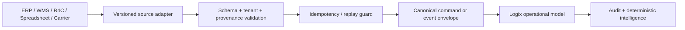

# Logix Integration Architecture

**Status:** MVP 1 integration architecture.  
**Decision:** Use a tenant-scoped, versioned adapter and normalized-event abstraction before introducing distributed-event infrastructure or building speculative connectors.

## Principles

1. **System-of-record authority remains local.** WMS owns warehouse execution, R4C owns project/commercial data, ERP owns accounting and orders, and Logix owns transport operations.
2. **Inbound facts are provenance-bearing.** Every imported or externally supplied operational fact records source system, source record ID, received time, payload digest, correlation ID and idempotency semantics.
3. **Commands and evidence differ.** An external tracking event supplies evidence; an authenticated Logix operator command performs a state transition subject to authorization and policy.
4. **Adapters normalize, not impersonate.** A connector maps external payloads into canonical envelopes. It must not expose source-specific fields as the core operational model.
5. **No premature connector build.** SAP, Oracle, Dynamics, carrier APIs, GPS, telematics and EDI are supported through the adapter contract; MVP 1 only provides the canonical interface and controlled manual/import pathways.

## Adapter contract



Every adapter implementation must expose the following conceptual contract. The first implementation may be an in-process service behind API routes; it does not require a message broker.

| Operation | Input | Required safeguards | Output |
|---|---|---|---|
| `validate` | Source payload and mapping version. | Schema validation, tenant resolution, field allow-list and size limits. | Accepted/rejected normalized preview. |
| `normalize` | Valid source payload. | Canonical ID mapping, timezone normalization, source provenance and required-field checks. | Canonical envelope. |
| `deduplicate` | Canonical envelope. | Tenant/source/external ID or idempotency-key lookup plus payload-digest comparison. | New, idempotent duplicate or replay conflict. |
| `apply` | Normalized command or event. | Object authorization, lifecycle/chronology rules and transactionality. | Persisted operational record and audit event. |
| `reportFailure` | Error context. | Sanitized error, correlation ID, no secret/raw attachment disclosure. | Structured error and audit/log entry. |

## Canonical envelope

```ts
interface CanonicalIntegrationEnvelope<T> {
  version: '1.0';
  tenantId: string;
  correlationId: string;
  causationId?: string;
  idempotencyKey: string;
  source: {
    system: string;
    recordId: string;
    receivedAt: string; // UTC ISO-8601
    payloadDigest: string;
    mappingVersion?: string;
  };
  entity: {
    type: string;
    canonicalId?: string;
    externalId?: string;
  };
  occurredAt: string; // UTC ISO-8601
  payload: T;
}
```

The eventual code uses the same properties as table columns/validated route input rather than retaining unbounded opaque JSON as a source of operational truth. Raw data is retained only where an approved evidence-retention policy requires it.

## Initial integration boundaries

| Producer / consumer | Direction | MVP 1 contract | Explicit non-authority |
|---|---|---|---|
| WMS → Logix | Read/event | Inventory movements, stock position, reservations, receiving/issue evidence, warehouse/site reference and source provenance. | Logix cannot create, modify or reverse WMS transactions. |
| R4C → Logix | Request/context | Project/WBS, material requirement, required-at-site date, delivery requirement and project reference. | Logix cannot alter R4C project, commercial or requirement records. |
| Logix → R4C | Status/impact | Shipment, ETA/tracking context, delivery status, logistics exception and project-impact reference. | Logix does not calculate commercial project truth independently. |
| ERP → Logix | Reference/import | Orders, delivery references, customer/supplier/location/material identifiers and source provenance. | Logix does not take ERP order/accounting authority. |
| Carrier / 3PL → Logix | Evidence | Provider update, booking confirmation, milestone, POD metadata and exception notification. | Carrier identity does not bypass tenant/object authorization. |
| Logix → carrier / 3PL | Future command | Tender/booking notice and controlled workflow tasks. | Deferred until provider-portal/adapter security is approved. |
| Spreadsheet → Logix | Governed import | Validated manual import through existing file parser/mapping/quality flow. | Spreadsheet never bypasses idempotency, tenant or chronology rules. |

## WMS adapter contract

The WMS boundary is read-only from Logix. WMS facts may inform shipment status or exception detection, but any state update is first classified as an external evidence event. Direct database integration, shared writes and warehouse transaction creation are prohibited.

| WMS fact | Canonical Logix use | Required fields | Validation |
|---|---|---|---|
| Inventory movement | Shipment-material or availability evidence. | Material, quantity, UOM, occurred time, WMS movement ID and site/warehouse reference. | Tenant/source mapping; idempotent external event. |
| Stock position | Risk/availability context. | Material, observed time, available/reserved quantities, location. | Snapshot provenance; no Logix inventory mutation. |
| Reservation | Requirement/shipment linkage. | Reservation ID, material, requested quantity, required date and warehouse reference. | Reference only; no reservation write-back. |
| Receiving / issue event | Pickup/delivery readiness evidence. | Event ID/type, material, quantity, occurred time and source. | Does not automatically override shipment lifecycle without policy. |

## R4C bridge contract

| R4C to Logix | Logix to R4C | Contract rule |
|---|---|---|
| Project ID, WBS ID, material requirement ID, material ID, required quantity/UOM, required-at-site date and delivery requirement reference. | Shipment ID, external request link, planned/actual dates, ETA context, delivery state and exception summary. | Each side owns its own aggregate; references are immutable evidence until formally corrected. |
| Project business-impact context. | Optional project-impact notification reference. | Logix reports logistics effects; R4C determines commercial/project treatment. |

## Event and replay policy

The operational model uses an append-only application-level event table/outbox pattern if and when outbound publication is needed. In MVP 1, the database transaction that mutates a logistics entity also writes its operational event and audit fact. This delivers reliable internal chronology without the failure modes of an unneeded broker.

| Scenario | Required outcome |
|---|---|
| Same event and payload received twice | Return idempotent success/reference; write no duplicate milestone or transition. |
| Same idempotency key, changed payload | Reject as replay conflict; log security-relevant audit evidence. |
| Out-of-order event | Preserve as received evidence only if valid; do not regress lifecycle or violate chronology. Otherwise reject and create a normalized exception/validation finding. |
| Stale external update | Do not overwrite a newer authoritative operational state; surface the stale source fact. |
| Invalid source mapping | Reject with structured, sanitized error and correlation ID. |
| Unknown source tenant mapping | Fail closed with no entity existence disclosure. |

## Attachment and webhook security

PODs and future provider webhooks are high-risk integration surfaces. Attachments must undergo extension/MIME/signature policy, filename sanitization, size limits, tenant-scoped storage naming, malware-scanning integration point and authorized download checks. Webhooks must require a configured sender identity, signature verification, timestamp tolerance, replay/idempotency key and correlation ID. No attachment URL or webhook secret is written to client-visible audit payloads.

## Capability metadata for the Diagnostic

Logix may publish static, non-sensitive capability metadata such as `carrier_management`, `transport_spend`, `shipment_operations`, `freight_audit` and `logistics_exceptions`. The Diagnostic can map observations to these capabilities but does not invoke internal operational commands.

## Evidence references

- [Existing Logix import pipeline and provenance fields](../../apps/api/src/routes/datasets.ts)
- [Existing source-reference contracts](../../packages/shared-types/src/logistics.ts)
- [Existing correlation middleware](../../apps/api/src/middleware/correlation.ts)
- [WMS logistics read adapter record](../../../kynox-second-brain/07%20Systems/KYNOX%20WMS%20Logistics%20Read%20Adapter%20Contract.md)
- [R4C logistics bridge record](../../../kynox-second-brain/07%20Systems/KYNOX%20R4C%20Logistics%20Bridge%20Contract.md)
