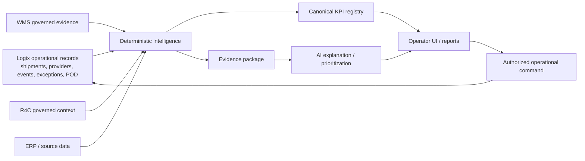

# Intelligence Core Boundary

**Status:** Architecture decision for embedded KYNOX intelligence.  
**Decision:** Shared intelligence is a reusable capability boundary, not a newly created product or repository. Logix consumes deterministic intelligence over governed operational evidence and keeps action authority in the operational domain.

## Boundary statement

The current Logix codebase already contains pure deterministic packages for inventory analytics, data quality, logistics spend/performance/risk and AI evidence interpretation. The current foundation must preserve this separation:

A deterministic calculation produces a metric, finding or risk result. An AI component may explain, rank, summarize or recommend based on an evidence package, but it cannot silently change the deterministic result or perform an operational command. A person or separately authorized system command remains accountable for any action.

## Existing capability disposition

| Capability | Current Logix evidence | Target disposition | Reason |
|---|---|---|---|
| Inventory analytics | `packages/analytics-engine` functions for ABC, XYZ, aging, consumption, excess/shortage, health, forecast and planning. | Retain as embedded/shared intelligence; do not move into shipment workflow code. | WMS, R4C and Diagnostic may also need it. |
| Data quality / parsing | `packages/data-quality` parser, scoring, cleansing and normalization functions. | Use through adapter/import boundary; later extract only with versioned-package governance. | It is source-neutral and cross-product. |
| Logistics intelligence | `packages/logistics-engine` spend, carrier-performance and risk functions. | Reuse directly against new operational evidence. | Prevents duplicate formulas and makes the operational model observable. |
| AI interpretation | `packages/ai-engine` provider abstraction, evidence packages and governance checks. | Retain evidence-first guardrails; add logistics prompts only after evidence objects are stable. | AI is advisory, not a replacement calculation engine. |
| Tenant/RBAC/audit | API middleware, audit service and shared role permissions. | Continue per product with aligned cross-product policy. | Security enforcement belongs beside every system of record. |

## Canonical KPI registry

The single definition source for Logix MVP 1 and shared logistics intelligence is [`LOGIX_KPI_REGISTRY.md`](./LOGIX_KPI_REGISTRY.md). A KPI is valid only when it specifies its numerator, denominator, inclusion/exclusion rules, time basis, timezone, source, owner and version.

| KPI family | Canonical implementation policy | Consumer |
|---|---|---|
| On-time pickup, on-time delivery, OTIF and transit variance | Reuse the carrier-performance/timing calculations where their contract fits; place missing canonical wrapper logic in the logistics engine—not route handlers. | Logix provider performance and exception workflow. |
| Transport spend, cost per shipment/ton, cost variance and invoice accuracy | Reuse the spend engine and charge evidence; preserve currency and denominator limitations. | Logix intelligence and future freight audit. |
| Shipment/material risk | Reuse the risk engine with requirement, availability and confirmed supply evidence. | Exception impact and recommendations. |
| Inventory turns, days on hand, dead stock, excess and stockout risk | Reuse inventory analytics formulas; display as linked intelligence, not Logix operational truth. | Cross-domain insight and future Control Tower. |

## KPI governance rules

1. Each formula resides in a deterministic engine package or an explicitly versioned canonical query. It does not reside in a page, controller or AI prompt.
2. Every response exposes the calculation version, data window and known limitations where appropriate.
3. Calculations respect tenant scope before aggregation and never combine tenant evidence.
4. Metrics with mixed currencies are not silently summed; they are grouped by currency or require an approved FX basis.
5. Metrics missing a valid denominator return an explicit `not_available`/limitation result rather than a fabricated zero.
6. A metric uses source timestamps and documented timezone semantics; local browser time is never an authoritative basis.
7. Any changed KPI definition increments its version and preserves the prior specification for auditability.

## AI guardrails

| AI may | AI must not |
|---|---|
| Explain a deterministic exception finding. | Invent event, provider, cost or ETA facts. |
| Prioritize exceptions using documented evidence and confidence. | Change a shipment state, award a carrier or close an exception silently. |
| Summarize carrier performance with source limitations. | Override deterministic formulas or conceal missing data. |
| Recommend a next operator action with assumptions labelled. | Treat a recommendation as a policy approval. |

## Consolidation decision

Inventory Analytics contains near-equivalent package structure. This proves a portfolio consolidation concern, but not a safe deletion/migration right. The chosen sequence is: (1) preserve current packages and tests, (2) use Logix operational evidence as an input to existing logistics functions, (3) define a versioned extraction target with dependency and rollback analysis, and (4) migrate only after compatibility tests are green. The detailed decision record is in the [consolidation plan](../migration/LOGIX_INTELLIGENCE_CONSOLIDATION_PLAN.md).

## Evidence references

- [Existing logistics-engine entry point](../../packages/logistics-engine/src/index.ts)
- [Existing transport-spend implementation](../../packages/logistics-engine/src/spend.ts)
- [Existing carrier-performance implementation](../../packages/logistics-engine/src/carrier-performance.ts)
- [Existing shipment/material-risk implementation](../../packages/logistics-engine/src/risk.ts)
- [Existing AI governance documentation](../../docs/AI_GOVERNANCE.md)
- [Canonical KPI registry](./LOGIX_KPI_REGISTRY.md)
