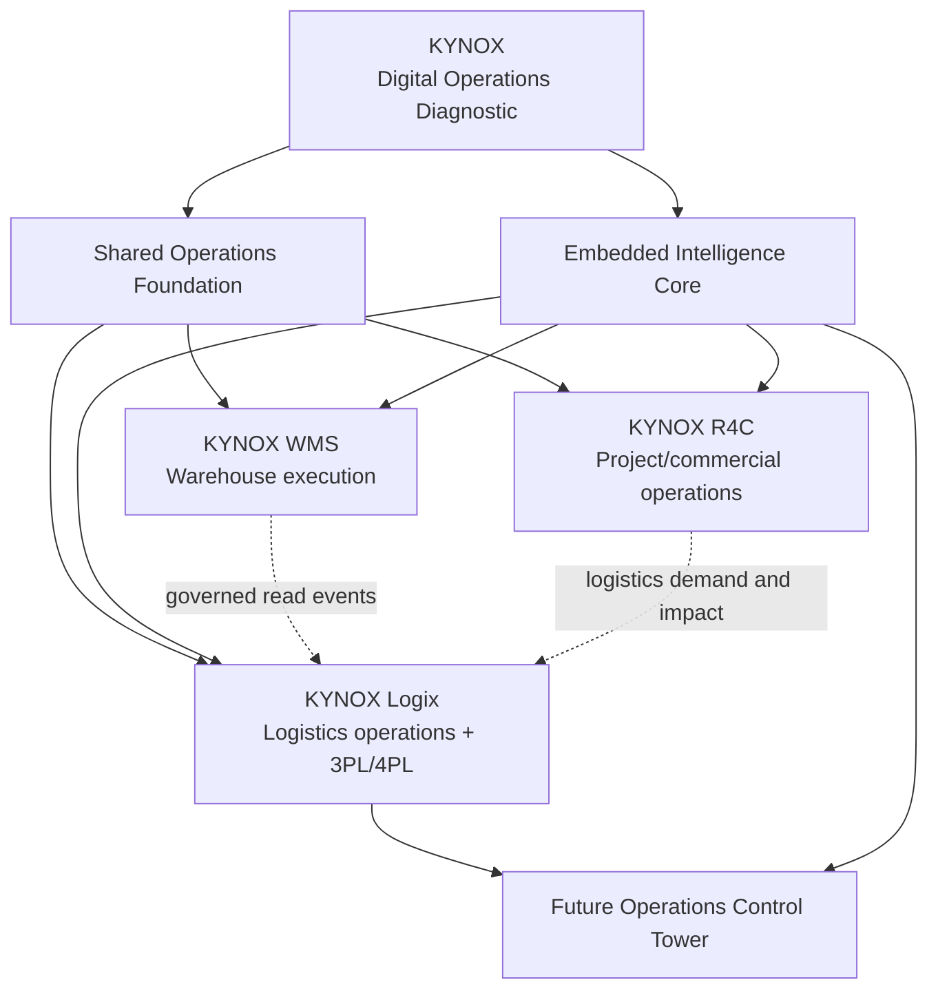

# KYNOX Portfolio Architecture V2

**Status:** Proposed target architecture, reconciled against repository evidence on 2026-08-14.  
**Confidence convention:** **Verified** statements cite current repository code or Git evidence. **Derived** statements are architectural conclusions from that evidence. **Documented** statements are planning records that require implementation validation. **Unknown** means that no stronger evidence was available during this review.

> **Target portfolio definition:** KYNOX Logix is a **Logistics Operations, 3PL Management and 4PL Orchestration Platform with embedded KYNOX intelligence**. It is not an intelligence-only product.

## Gate 0 — Evidence baseline

The reconciliation inspected the write target and six reference repositories. The primary repository was clean, synchronized with `origin/main`, had no open pull requests and no unmerged remote feature branches at inspection time. Its two latest base-branch workflow runs, **CI** and **KAAF Architecture**, both completed successfully. The local baseline test command, `npm test`, passed **8 test files and 93 tests** before this change.

| Repository | Branch inspected | Commit | Evidence-based current role | Confidence |
|---|---:|---|---|---|
| [`Islamce/kynox-logix`](../../) | `main` | `cd847997358a869fb0b51a43586d5b29b4b7463c` | Inventory-diagnostic monorepo with logistics import preview and deterministic logistics-intelligence functions; no operational shipment persistence. | Verified |
| `Islamce/kynox-inventory-analytics` | `hostinger-uat` | `535198c96af52eaa8d4d97eb68256169b1fff9e1` | Source-equivalent inventory-intelligence implementation with ingestion, quality, analytics, tenant controls and logistics-intelligence packages. | Verified |
| `Islamce/WMS` | `main` | `76a9034d5dcf2e7a873012dd2ef3cade3914507a` | Warehouse-execution application for receiving, allocation, picking, issuing, reallocation and operational audit. | Verified |
| `Islamce/R4C` | `main` | `124dee8b047c39da509555fdbd49d4c16e176bfd` | Bounded construction/project and commercial application with Project, materials, commercial and tenant modules. | Verified |
| `Islamce/KAAF` | `main` | `d759c69b2eb868f57f71cf1cb075415f5ba64f9e` | Architecture-governance framework and repository-structure validator. | Verified |
| `Islamce/kynox-second-brain` | `main` | `7757a1a4a7b1647062b02ca44ad8c5fad0533be7` | Operational-memory and strategy records, including logistics and cross-product contracts. | Verified |
| `Islamce/Islamce-kynox-interface` | `main` | `4d98d04708605ec6511e55f4e7c51796f4f6db84` | Public product-interface repository that currently names WMS, analytics and R4C but has no frozen Logix public presentation. | Verified |

The primary repository's generated KAAF context still identifies itself as **Kynox Inventory Intelligence** and describes logistics persistence as gated. The existing code corroborates that description: `apps/api/src/routes/datasets.ts` rejects final creation of a `logistics` dataset with a `409` response, while `packages/logistics-engine` provides only pure analytical calculations. This is the precise gap the current foundation work addresses.

## Reconciled target architecture

The **Shared Operations Foundation** and **Embedded Intelligence Core** are architectural capabilities, not automatically additional products or repositories. Their reusable boundaries are contracts, deterministic libraries, identity conventions and event envelopes. They must be extracted only when evidence demonstrates an operational need shared by more than one deployed application.

| Portfolio element | Classification | Primary responsibility | Explicit boundary |
|---|---|---|---|
| KYNOX Digital Operations Diagnostic | Future-facing diagnostic surface | Match operational problems to KYNOX capabilities. | Does not own operational transactions or become part of Logix. |
| Shared Operations Foundation | Architectural capability | Canonical identifiers, integration envelope, audit vocabulary, tenancy/RBAC conventions and workflow/event patterns. | Does not silently centralize independent systems of record. |
| Embedded Intelligence Core | Architectural capability | Deterministic analytics, KPI definitions, data quality, risk and evidence packages. | Must not replace operational ownership or deterministic results with AI output. |
| KYNOX WMS | Core application | Warehouse execution and warehouse-led traceability. | Logix reads governed logistics-relevant facts; it does not write warehouse movements. |
| KYNOX Logix | Core application | Transport requirements, shipments, providers, execution events, exceptions, POD and future orchestration. | It does not become a warehouse-management, accounting or project-commercial system. |
| KYNOX R4C | Bounded application | Project/WBS context, commercial exposure and delivery requirements. | It requests logistics service and consumes delivery impact; it does not own shipment execution. |
| Operations Control Tower | Future capability | Cross-domain operational cockpit, recommended actions and approvals. | Deferred as a product UI; its data prerequisites are designed now. |

## Architecture before and after

| Concern | Before reconciliation | Target after this foundation |
|---|---|---|
| Logix identity | Inventory/supply-chain intelligence diagnostic with additive logistics analytics. | Logistics operations and 3PL/4PL orchestration platform with embedded intelligence. |
| Logistics data | File detection, mapping and read-only preview; logistics persistence deliberately rejected. | Tenant-scoped operational shipment records, lifecycle events, exceptions, POD metadata and provider records. |
| WMS relationship | Read-only warehouse references in shared types. | Explicit read/event adapter contract; WMS remains execution authority. |
| R4C relationship | Requirement reference type only. | Future request/status/impact contract with ownership held on each side. |
| Intelligence | Pure transport-spend, carrier-performance and shipment/material-risk functions. | Reused against operational evidence; no duplicate formula engine. |
| Control Tower | Strategy documents only. | Deferred UI with Control-Tower-ready identifiers, events, exceptions and audit facts. |

## Current-state portfolio map

| Product / repository | Product, module, or capability | What code or records prove | Reconciliation decision |
|---|---|---|---|
| Logix | Existing monorepo and future core application | `apps/api`, `apps/web`, `packages/*`, tenant migration and logistics package. | Keep in this repository; convert incrementally from diagnostic-led scope to Logix MVP 1. |
| Inventory Analytics | Existing intelligence implementation | Mirrors Logix's packages and inventory import pipeline. | Do not mass-copy; treat as migration/reference source pending a governed consolidation decision. |
| WMS | Core product | Express routes/services for receiving, inventory, allocation, picking and reallocation; mobile warehouse screens. | Keep warehouse execution outside Logix. |
| R4C | Bounded domain product | NestJS modules for projects, materials, commercial and tenants. | Keep project/commercial truth outside Logix. |
| KAAF | Governance capability | Repository architecture manifests, generators and validators. | Use for drift control; do not let stale taxonomy override source evidence. |
| Second Brain | Operational-memory capability | Logistics MVP, RBAC, WMS adapter, R4C bridge and control-tower records. | Reconcile after implementation evidence stabilizes; never record unimplemented scope as delivered. |
| Public interface | Public product interface | React content and product-architecture documentation. | Prepare a future naming change note only; no website redesign in this branch. |

## Frozen scope for this branch

This branch implements the **minimum stable MVP 1 foundation**: tenant-scoped operational entities, provider records, shipment lifecycle enforcement, auditable milestones/events, first-class exceptions, POD metadata, operational API tests and an operator-centered journey. It expressly excludes fleet management, driver payroll, vehicle maintenance, full accounting, route optimization, standalone procurement, customs processing, marketplace features, autonomous 5PL and a separate control-tower product.

The evidence gate found no technical justification for a new repository. The implementation remains on `feat/logix-operations-4pl-foundation` in the existing primary repository.

## Evidence references

- [Logix API scope and logistics persistence gate](../../apps/api/src/routes/datasets.ts)
- [Logix tenant foundation migration](../../apps/api/src/db/migrations/20260812000004_tenant_foundation.js)
- [Logix shared logistics contracts](../../packages/shared-types/src/logistics.ts)
- [Logix deterministic logistics intelligence](../../packages/logistics-engine/src/index.ts)
- [Logix generated KAAF context](../../.ai/ai-context.json)
- [Repository operating rules](../../AGENTS.md)

## Reconciliation status

| Gate | Result | Notes |
|---|---|---|
| Gate 0 — evidence | Complete | Repository/branch/SHA/CI/test baseline captured above. |
| Gate 1 — architecture | Complete in documentation | Product boundary, ownership, canonical model, domain model, intelligence boundary, integrations and migration plan are linked below. |
| Gate 2 — foundation | In implementation | Scope is intentionally limited to MVP 1 operations foundation. |
| Gate 3 — intelligence integration | In implementation | Existing deterministic metrics are connected to operational evidence rather than copied. |
| Gate 4 — operator workflow | In implementation | Shipment-to-POD journey is the acceptance path. |
| Gate 5 — validation | Pending final changes | Tests, type checks, build, KAAF checks and security scenarios must pass before delivery. |

Related design records: [Product boundary](./LOGIX_PRODUCT_BOUNDARY.md), [ownership matrix](./CAPABILITY_OWNERSHIP_MATRIX.md), [canonical model](./CANONICAL_OPERATIONS_MODEL.md), [domain model](./LOGIX_3PL_4PL_DOMAIN_MODEL.md), [integrations](./INTEGRATION_ARCHITECTURE.md), [intelligence boundary](./INTELLIGENCE_CORE_BOUNDARY.md) and [roadmap](../roadmap/LOGIX_MVP_ROADMAP.md).
