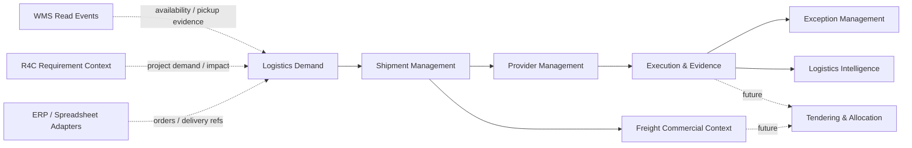

# Logix 3PL/4PL Domain Model

**Status:** Bounded-domain design for MVP 1 with explicit MVP 2 and MVP 3 seams.  
**Rule:** Logix controls logistics operations and provider coordination, while partners execute physical transport and external systems retain their own operational authority.

## Domain map

## Domain A — Logistics Demand

**Purpose.** Transform an externally originated customer order, ERP delivery, material requirement, project requirement or manually entered request into a controlled **Transport Requirement**. A transport requirement is logistical demand; it is not an order-management replacement.

| Input / responsibility | MVP 1 | Future evolution | Boundary |
|---|---|---|---|
| Manual transport request | Supported | Add structured request templates and approvals. | Logix owns the request once created. |
| ERP delivery/order reference | Reference link and source provenance. | Adapter-driven creation/update. | ERP remains order authority. |
| WMS inventory/reservation evidence | Read-only reference/evidence. | Event-based demand fulfilment context. | WMS remains execution authority. |
| R4C project requirement | Reference link, project/WBS/required-at-site context. | Governed request API. | R4C remains project-commercial authority. |
| Transport requirement lifecycle | Designed and persisted. | Tender/award linkage. | No procurement-suite behavior. |

## Domain B — Shipment Management

**Purpose.** Provide the operational record for planning and executing a shipment, including consolidation/split readiness and multimodal legs without sacrificing deterministic lifecycle control.

| Capability | MVP 1 commitment | Future-compatible seam |
|---|---|---|
| Shipment creation | Create tenant-scoped shipment from a manual or linked transport requirement. | Conversion/wizard from external demand. |
| Consolidation and split | Relationship-ready design; no automated optimizer. | Shipment grouping, split/replan workflow. |
| Shipment legs | Persist ordered legs with origin, destination, mode and provider context. | Leg-level tender/award and transfer events. |
| Dates and status | Planned, actual and required delivery dates; controlled state machine. | Predictive ETA and scheduling integrations. |
| Business references | Order, PO, project, WBS, material and external tracking references. | Canonical master-data adapters. |

## Domain C — Provider Management

**Purpose.** Maintain the tenant-scoped operational profile of carriers, 3PL providers and freight forwarders that perform or coordinate transport work.

| Provider property | MVP 1 | Future use |
|---|---|---|
| Provider type | Carrier, 3PL or forwarder. | Nested service networks and partner entities. |
| Service capability | Mode/service type and active status. | Lane, capacity and qualification policies. |
| Operational assignment | Assign a provider to shipment or leg. | Award, alternate provider and allocation. |
| Performance | Reuse carrier-performance metrics. | Provider scorecards and controlled provider portal. |
| Contract reference | External identifier/reference only. | Versioned rate/contract applicability. |

A carrier/3PL portal is a future user surface. The core API must preserve a distinct external-provider actor type and scoped data-sharing policy, but the portal is not implemented ahead of the internal operator workflow.

## Domain D — Tendering and Allocation

**Purpose.** Prepare the model for controlled provider selection without overbuilding a TMS or implementing tendering before the shipment evidence base is stable.

| Capability | Current decision | Prerequisite |
|---|---|---|
| Provider selection record | Provider assignment is MVP 1. | Provider profile and shipment demand. |
| Tender | **Design now; build in MVP 2.** | Transport requirement, candidate provider and auditable offer model. |
| Accept/reject | **Deferred.** | Provider actor authentication and portal/adapter. |
| Award/allocation | **Deferred.** | Tender response, approval policy and capacity context. |
| Alternative provider | **Deferred.** | Exception/replan workflow and commercial guardrails. |

## Domain E — Execution and evidence

**Purpose.** Progress a shipment through a deterministic lifecycle using planned and actual evidence, while preserving source provenance and allowing multimodal leg detail.

The base lifecycle is `planned → booked → ready → picked_up → in_transit → arrived → delivered → pod_confirmed → closed`. The implementation prevents invalid state transitions, requires evidence for execution milestones and records every accepted transition as an auditable operational event. A status change is a command; a milestone or source event is evidence. They are related but not interchangeable.

| Event / milestone | Primary effect | Evidence required | Exception interaction |
|---|---|---|---|
| Pickup | Confirms custody transfer; allows `picked_up`. | Actor/source and timestamp. | Late pickup can open an exception. |
| Departure | Confirms transit begins; supports `in_transit`. | Source/provenance and timestamp. | Missing departure can create a visibility exception. |
| Arrival | Confirms destination arrival. | Location/time evidence. | ETA slippage/missed milestone may remain open. |
| Delivery | Confirms delivery. | Delivery milestone. | Damage/missing POD may remain open. |
| POD received | Confirms POD metadata/reference. | Validated attachment metadata or trusted external reference. | Missing/rejected POD creates or resolves an exception. |

## Domain F — Exception Management

**Purpose.** Make logistics exceptions first-class operational records rather than dashboard alerts. Exceptions expose impact and ownership across shipments, materials, orders, inventory and projects, without taking ownership of WMS/R4C data.

| Exception element | Required behavior |
|---|---|
| Classification | Controlled type such as pickup delay, carrier rejection, missed milestone, ETA slippage, damaged cargo, missing POD, rate discrepancy or invoice discrepancy. |
| Severity | Critical, high, medium, low or informational; independent of raw alert count. |
| Ownership | Assigned Logix user/role or escalated provider owner; assignment changes are audited. |
| SLA | Target response/resolution time recorded in UTC, with escalation context. |
| Impact | Link to shipment and optional material, order, inventory, customer, project/WBS and monetary/exposure reference. |
| Recommendation | Optional, evidence-labelled recommendation; never an autonomous action. |
| Approval/resolution | Supports owner action, approval when a policy requires it, resolution reason and auditable history. |

## Domain G — Freight Commercial Context

**Purpose.** Hold the operational context necessary to compare expected and actual freight cost without becoming an accounting system.

| Commercial fact | MVP 1 | MVP 2+ | Authority |
|---|---|---|---|
| Freight charge | Shipment-linked amount/currency/type and expected/actual flag. | Accessorial and fuel-surcharge calculation. | Logix operational record. |
| Rate / contract | Reference only. | Rate card, validity and expected-cost calculation. | Contract source/ERP/Logix policy. |
| Invoice | Optional reference/evidence only. | Invoice matching, variance and dispute workflow. | ERP is accounting authority. |
| Claim / settlement | Designed only. | Claim/dispute workflow. | Finance/legal policy outside MVP 1. |

## Intelligence boundary

Transport spend, carrier performance and material/shipment risk remain deterministic functions in `packages/logistics-engine`. Operational records become their evidence inputs. The intelligence layer may surface findings and recommendations to the operator, but it cannot change a shipment state, provider assignment or exception without an authenticated, authorized command and corresponding audit record.

## Design outcomes

The model is 3PL-capable because it supports tenant-scoped provider execution evidence and operator workflows. It is 4PL-ready because transport requirements, provider assignment, event provenance, exception impact and future tender/award seams use stable identifiers. It does not claim marketplace, fleet, driver, route-optimization, customs or autonomous-optimization capability.

## References

- [Canonical operations model](./CANONICAL_OPERATIONS_MODEL.md)
- [Product boundary](./LOGIX_PRODUCT_BOUNDARY.md)
- [Intelligence-core boundary](./INTELLIGENCE_CORE_BOUNDARY.md)
- [MVP roadmap](../roadmap/LOGIX_MVP_ROADMAP.md)
